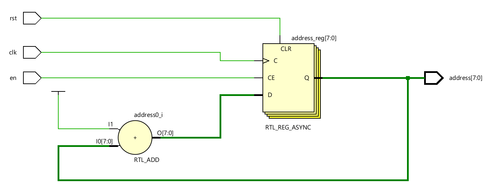
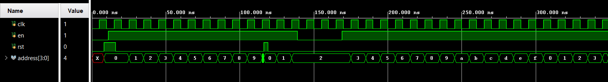

# Address Generator 

The address generation unit is responsible for producing a sequence of memory addresses 
required during the execution of the memory self-test operation. It operates in a sequential 
manner, ensuring that each memory location is accessed in an orderly fashion. The address 
sequence begins from a known initial value after reset and progresses linearly through the 
memory space, enabling systematic read and write operations across all locations under test.  

The address generation logic is synchronized with the system clock and includes an enable 
control mechanism to regulate address advancement. When enabled, the address value is 
incremented on each clock cycle, allowing continuous traversal of memory locations. When 
disabled, the current address is held constant, preventing unintended memory access. This 
controlled sequencing supports precise coordination with the MBIST controller during test 
execution. 

---
## Ports

| Port Name | Direction | Width | Description |
|:--- |:--- |:--- |:--- |
| clk | Input | 1-bit | Global clock signal for synchronous incrementing. |
| rst | Input | 1-bit | Asynchronous active-high reset to return the address to 0. |
| en | Input | 1-bit | Enable signal from the FSM controller to trigger address incrementing. |
| address | Output | [addr-1:0] | The current memory location being accessed for reading or writing. |

---
## RTL Schematic

---

## Simulation Results 

The expected simulation output shows the address counter incrementing sequentially on each 
clock cycle when the enable signal is asserted. Upon assertion of the reset signal, the address 
value is cleared to zero, regardless of the clock state. When the enable signal is deasserted, the 
address remains constant, indicating that counting is paused. Reasserting the enable signal 
resumes sequential address generation from the reset or last stored value. 

