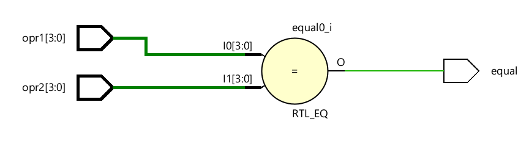
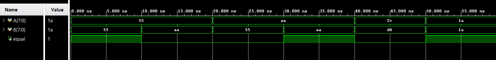

# Comparator

The comparator module is a combinational logic block responsible for verifying the correctness 
of data read from the memory during the test process. Its primary function is to compare the 
data retrieved from the memory with the expected test pattern generated by the MBIST logic. 
By performing a bit-wise comparison, the module determines whether the memory output 
matches the intended value for a given test cycle.  

If a mismatch is detected during comparison, the module indicates a fault condition to the 
control logic, enabling immediate identification of erroneous memory behavior. Since the 
comparison operation is purely combinational, the module does not require a clock signal and 
produces results with minimal latency. This allows rapid fault detection and supports early 
termination of the test process when an error is encountered. 

---
## Ports

| Port Name | Direction | Width | Description |
| :--- | :--- | :--- | :--- |
| opr1 | Input | [data-1:0] | Operand 1: Typically receives the data read from memory (mem_dout). |
| opr2 | Input | [data-1:0] | Operand 2: Typically receives the expected pattern from the pattern generator. |
| equal | Output | 1-bit | Logical high ('1') if both inputs match; logical low ('0') if a mismatch occurs. |

---
## RTL Schematic

---
## Simulation Results

The comparator testbench verifies the functionality of the data comparison module by applying 
various matching and mismatching input combinations. When both input operands are 
identical, the equal signal is expected to assert, indicating a successful comparison. For 
differing input values, the equal signal remains deasserted, indicating a mismatch. The 
simulation results validate its suitability for use in the MBIST read and compare operation. 

