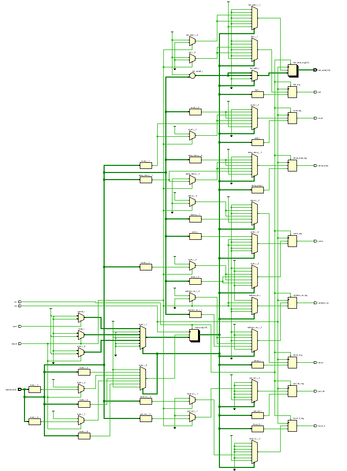

# FSM Based Controller

The MBIST controller is implemented as a finite state machine (FSM) responsible for 
coordinating the overall test operation. It controls the sequence of memory write and read 
operations, enables address progression, and selects the appropriate test data patterns. The 
controller initiates the test upon receiving a start request and executes multiple test phases to 
apply complementary data patterns across the memory. During read operations, the controller 
monitors the comparison result and immediately terminates the test if a mismatch is detected, 
asserting a fault indication and capturing the corresponding memory address. Upon successful 
completion of all test phases, the controller signals test completion. This FSM-based approach 
ensures deterministic control flow, early fault detection, and reliable operation of the MBIST 
subsystem.

---
# Ports 

| Port Name | Direction | Width | Description |
| :--- | :--- | :--- | :--- |
| clk | Input | 1-bit | Global system clock for synchronous state transitions. |
| rst | Input | 1-bit | Asynchronous active-high reset to initialize the FSM to the IDLE state. |
| start | Input | 1-bit | Trigger signal to initiate the MBIST test sequence. |
| equal | Input | 1-bit | Feedback from the comparator; '0' indicates a memory fault. |
| address | Input | [addr-1:0] | Feedback of the current address to detect end-of-memory boundaries. |
| address_en | Output | 1-bit | Enable signal to the Address Generator to increment the pointer. |
| force_0 | Output | 1-bit | Control signal to force the pattern generator to output all zeros. |
| pat_sel | Output | 1-bit | Selects between the primary and complementary checkerboard patterns. |
| read | Output | 1-bit | Memory read enable signal. |
| write | Output | 1-bit | Memory write enable signal. |
| delay_data | Output | 1-bit | Control signal to synchronize data alignment for the comparator. |
| done | Output | 1-bit | High signal indicating the test sequence has concluded. |
| fail | Output | 1-bit | High signal indicating a fault was detected during the read phase. |
| fail_addr | Output | [addr-1:0] | Registered address of the detected fault for diagnostic reporting. |

---
# RTL Schematic

