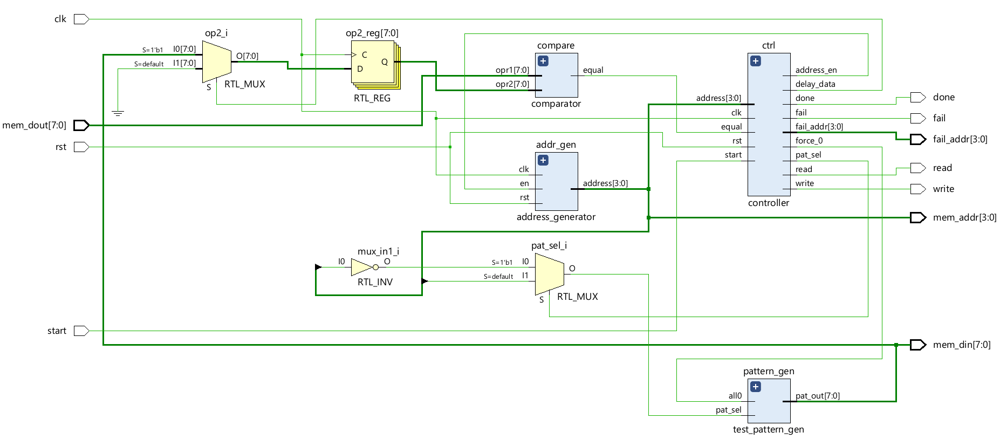
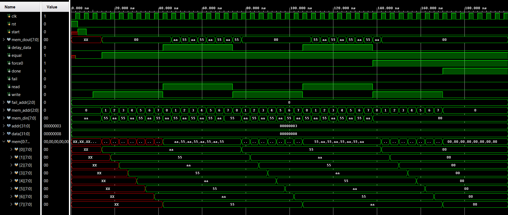
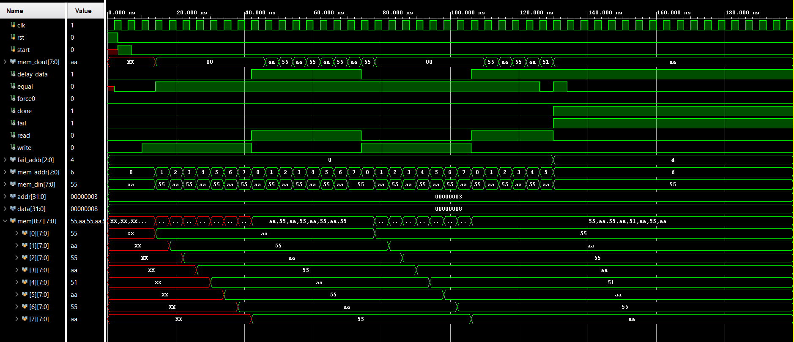

# MBIST Controller

The MBIST controller is the core component of the proposed MBIST subsystem and is 
responsible for coordinating the memory test operation. It is implemented using a modular 
architecture that consists of a checkerboard pattern generator, a sequential address generator, a 
comparator, and an FSM-based control unit. Each sub-module performs a specific function, 
enabling a clear separation of responsibilities and simplifying verification and reuse.   

The FSM-based control unit governs the sequence of read and write operations during testing 
and manages address progression. The comparator continuously checks the read data against 
the expected pattern, and upon detection of a mismatch, the controller immediately terminates 
the test and asserts a fault indication along with the corresponding fault address. The controller 
is fully parameterized with respect to address and data widths, allowing the design to be easily 
scaled for different memory configurations. 

---
## Ports

| Port Name | Direction | Width | Description |
| :--- | :--- | :--- | :--- |
| clk | Input | 1-bit | Global clock signal for synchronous operation. |
| rst | Input | 1-bit | Active-high asynchronous reset to initialize the FSM and registers. |
| start | Input | 1-bit | Trigger signal to begin the MBIST Checkerboard sequence. |
| mem_dout | Input | [data-1:0] | Data read back from the Memory Under Test (MUT) for comparison. |
| done | Output | 1-bit | High when the test completes successfully for all memory locations. |
| fail | Output | 1-bit | Asserted immediately when a data mismatch is detected. |
| read | Output | 1-bit | Read enable signal sent to the memory wrapper/MUT. |
| write | Output | 1-bit | Write enable signal sent to the memory wrapper/MUT. |
| fail_addr | Output | [addr-1:0] | Latches the specific address where a fault was detected. |
| mem_addr | Output | [addr-1:0] | The current address generated by the MBIST controller for the Memory under test. |

---
## RTL Schematic

---
## Simulation Results

The simulation waveform of the MBIST controller under fault-free conditions demonstrates 
correct sequencing of write and read operations as per the checkerboard testing algorithm. The 
required data patterns are written to the memory and subsequently read back without any 
mismatch. During the compare phase, the read data is found to be equal to the expected pattern 
for all memory locations. Upon successful completion of the test, the controller asserts the done 
signal while the fail signal remains deasserted, indicating a pass condition. 

The simulation waveform of the MBIST controller under fault conditions illustrates correct 
detection of a memory error at address 4. During the read and compare phase, a data mismatch 
is observed, causing the controller to assert the fail signal and capture the corresponding fault 
address. The done signal is asserted along with the failure indication, confirming test 
termination. Further memory operations are halted immediately after fault detection, 
demonstrating the controller’s early-exit capability. 

