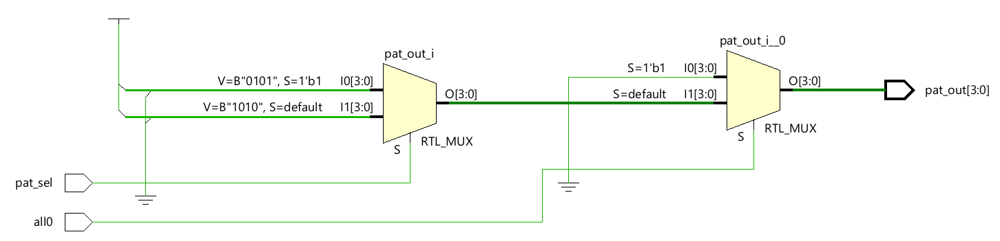
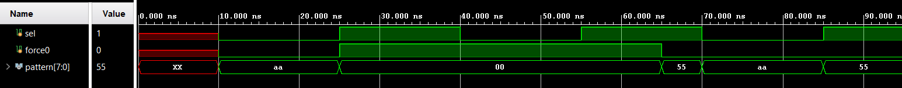

# Checkerboard Pattern Generator

The checkerboard pattern generator is responsible for producing test data patterns required for 
memory testing. It generates alternating logic values across the data word, which helps in 
detecting data-dependent and coupling-related memory faults. The pattern generation logic is 
purely combinational and produces output patterns based on control inputs provided by the 
MBIST control logic. In addition to checkerboard patterns, it  also supports generation of an 
all-zero pattern, which is commonly used during initialization or specific test phases.  

The generated checkerboard patterns consist of alternating ‘1’ and ‘0’ values across the data 
width, with complementary patterns applied in different test phases. The design is 
parameterized with respect to data width, allowing the same logic to be reused for memories 
of varying word sizes. By keeping the pattern generator independent and configurable, the 
overall MBIST architecture maintains modularity and flexibility, while ensuring effective 
pattern generation for reliable memory testing. 

---
## Ports

| Port Name | Direction | Width | Description |
| :--- | :--- | :--- | :--- |
| all0 | Input | 1-bit | Control signal to force the output to zero (used during initialization or specific reset phases). |
| pat_sel | Input | 1-bit | Selects between the two complementary checkerboard patterns (10101010 and 01010101). |
| pat_out | Output | [data-1:0] | The generated data pattern sent to the memory or comparator. |

---
## RTL Schematic

---
## Simulation results

The expected simulation output shows the pattern generator producing alternating 
checkerboard data patterns based on the pattern select control signal. When the select signal is 
toggled, the output pattern switches accordingly between the two predefined data patterns. 
Upon assertion of the force-zero control signal, the output is forced to all zeros irrespective of 
the selected pattern. Once the force-zero signal is deasserted, normal pattern generation 
resumes, confirming correct functional behavior of the pattern generator module.

