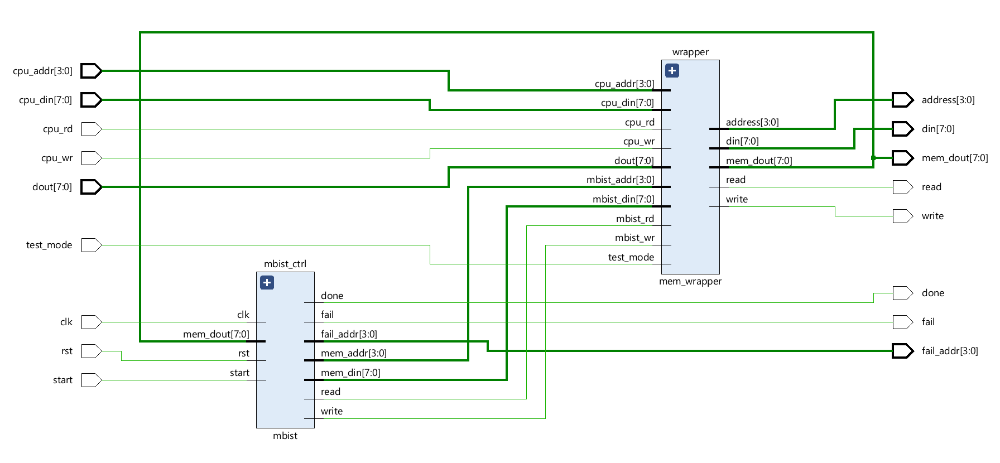
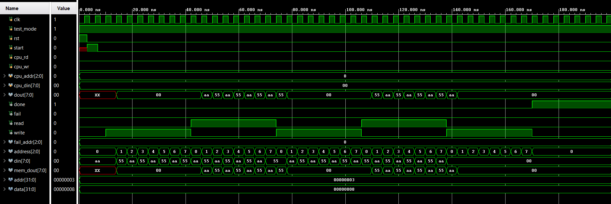
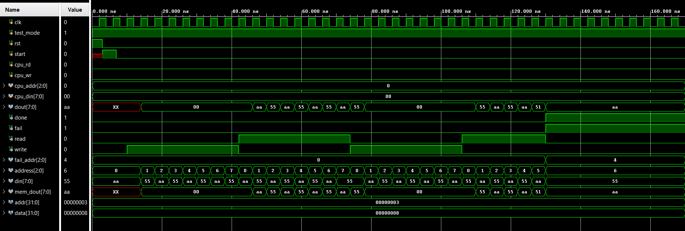

# MBIST Subsystem

The MBIST subsystem represents the top-level integration of the memory test logic and the 
memory access interface. It is designed to coordinate the execution of memory self-test 
operations while providing a clear separation between test functionality and normal system 
access. The subsystem integrates the MBIST control logic with a memory interface 
mechanism, enabling controlled access to the memory during test mode. This hierarchical 
organization improves modularity and allows the MBIST logic to be reused or extended in 
larger system designs.  

A mode selection mechanism is incorporated within the subsystem to switch memory access 
between normal system operation and MBIST operation. When the test mode is enabled, 
memory read and write operations are driven exclusively by the MBIST logic, allowing 
autonomous execution of the test sequence. During normal mode, memory access can be 
controlled by external system signals. The subsystem also provides status outputs to indicate 
test completion and fault detection, along with the corresponding fault address. This structure 
enables seamless integration of the MBIST functionality into system-level designs while 
maintaining clear test isolation. 

---
## Ports 

| Port Name | Direction | Width | Description |
| :--- | :--- | :--- | :--- |
| test_mode | Input | 1-bit | Global control signal to switch the system between Functional (CPU) and Test (MBIST) modes. |
| clk | Input | 1-bit | Master clock for the MBIST controller and synchronized memory operations. |
| rst | Input | 1-bit | Master reset signal to initialize the internal FSM and counters. |
| start | Input | 1-bit | Command signal to begin the internal memory testing sequence. |
| cpu_rd | Input | 1-bit | Functional read enable signal from the CPU/System bus. |
| cpu_wr | Input | 1-bit | Functional write enable signal from the CPU/System bus. |
| cpu_addr | Input | [addr-1:0] | Functional address bus from the CPU/System bus. |
| cpu_din | Input | [data-1:0] | Functional data input bus from the CPU/System bus. |
| dout | Input | [data-1:0] | Direct data output connection from the physical Memory Under Test. |
| done | Output | 1-bit | Status flag indicating the MBIST test has finished. |
| fail | Output | 1-bit | Status flag indicating a fault was detected in the memory. |
| fail_addr | Output | [addr-1:0] | Diagnostic output providing the address of the detected fault. |
| read | Output | 1-bit | Final Read Enable signal routed to the memory. |
| write | Output | 1-bit | Final Write Enable signal routed to the memory. |
| address | Output | [addr-1:0] | Final Address bus routed to the memory. |
| din | Output | [data-1:0] | Final Data input bus routed to the memory. |
| mem_dout | Output | [data-1:0] | Buffered data from memory routed back to the system/CPU. |

---
## RTL Schematic

---
## Simulation results 

The simulation waveform of the MBIST subsystem demonstrates correct top-level 
integration and functional operation of the entire design. The test sequence proceeds as 
expected, with proper execution of write, read, and compare phases under the control of the 
MBIST logic. No error condition is observed during the simulation, as indicated by the absence 
of the fault flag and successful assertion of the completion signal. This confirms that the overall 
test flow is correctly coordinated at the subsystem level and operates as intended.    

The simulation waveform of the MBIST subsystem illustrates correct fault detection during 
the test operation. A mismatch is identified at a specific memory location, resulting in assertion 
of the fault signal and capture of the corresponding fault address as address 4. Upon detection 
of the fault, the test sequence is terminated immediately, as intended by the design flow. This 
behavior confirms proper coordination between the MBIST controller, comparator, and 
memory interface at the top-module level. 

