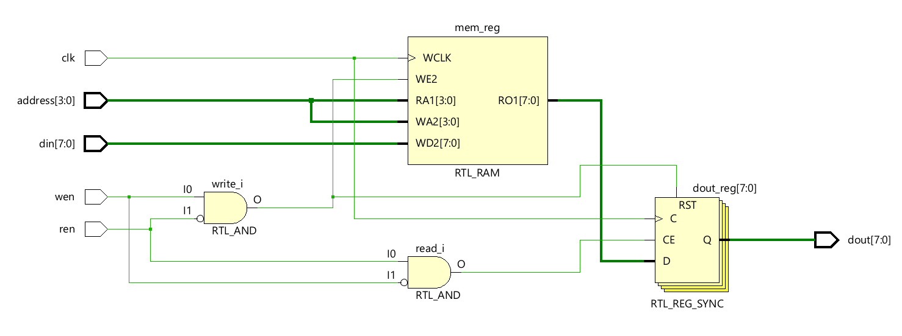
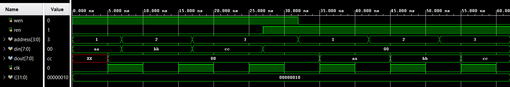

# Memory Under Test

The memory under test is modeled as a synchronous single-port memory used for functional 
verification of the MBIST subsystem. It supports mutually exclusive read and write operations 
controlled by dedicated enable signals and operates on the rising edge of the clock. During a 
write operation, input data is stored at the specified address, while the output is cleared to avoid 
invalid read values. During a read operation, the stored data corresponding to the addressed 
location is presented at the output. This behavioral memory model provides a controlled 
environment for validating data integrity, read/write sequencing, and fault detection 
mechanisms implemented by the MBIST logic.  

---
## Ports 

| Port Name | Direction | Width | Description |
| :--- | :--- | :--- | :--- |
| clk | Input | 1 | System clock signal; all operations occur on the rising edge. |
| wen | Input | 1 | Write Enable: Initiates a write operation when high (and ren is low). |
| ren | Input | 1 | Read Enable: Initiates a read operation when high (and wen is low). |
| address | Input | addr (4) | Memory address pointer (defaults to 16 locations). |
| din | Input | data (8) | Data Input: The value to be stored in memory. |
| dout | Output | data (8) | Data Output: The value retrieved from memory or zeroed out. |

---
## RTL Schematic

---
## Simulation Results

The simulation results confirm correct operation of the memory module under test. Data written 
to specific memory locations during the write phase is accurately stored and subsequently 
retrieved during the read phase. The output data matches the previously written values for all 
tested addresses, demonstrating proper read and write functionality synchronized to the clock. 
These results verify that the memory model behaves as expected and is suitable for validating 
the MBIST subsystem. 

