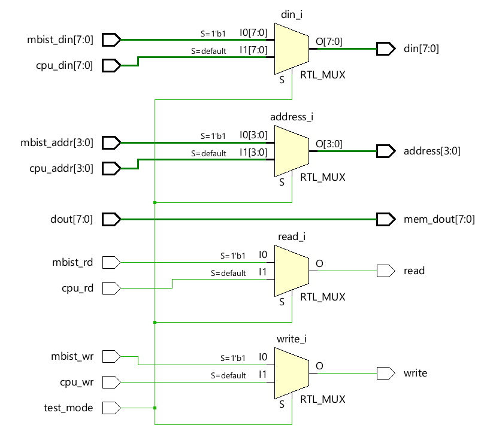
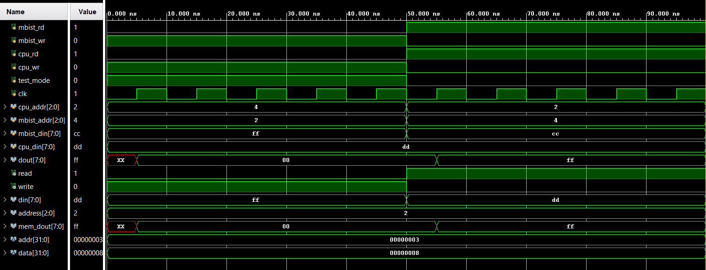

# Memory Wrapper

The memory wrapper acts as an interface layer between the memory module and the external 
control logic, enabling seamless switching between normal system operation and memory test 
operation. Its primary function is to multiplex memory access signals such as address, data, 
and control lines based on the current mode of operation. This approach allows the same 
memory resource to be accessed either by the functional system logic or by the MBIST logic 
without interference, thereby improving controllability and isolation during testing. 

---
## Ports 

| Port Name | Direction | Width | Description |
| :--- | :--- | :--- | :--- |
| test_mode | Input | 1-bit | Select signal: '1' for MBIST mode, '0' for CPU mode. |
| mbist_rd | Input | 1-bit | Read enable signal originating from the MBIST FSM. |
| mbist_wr | Input | 1-bit | Write enable signal originating from the MBIST FSM. |
| mbist_addr | Input | [addr-1:0] | Test address generated by the MBIST controller. |
| mbist_din | Input | [data-1:0] | Checkerboard pattern data from the MBIST controller. |
| cpu_rd | Input | 1-bit | Functional read enable signal from the CPU. |
| cpu_wr | Input | 1-bit | Functional write enable signal from the CPU. |
| cpu_addr | Input | [addr-1:0] | Functional address bus from the CPU. |
| cpu_din | Input | [data-1:0] | Functional data bus from the CPU. |
| dout | Input | [data-1:0] | Raw data output coming directly from the SRAM/Memory. |
| read | Output | 1-bit | Final read signal sent to the memory chip. |
| write | Output | 1-bit | Final write signal sent to the memory chip. |
| address | Output | [addr-1:0] | Final address bus sent to the memory chip. |
| din | Output | [data-1:0] | Final data input bus sent to the memory chip. |
| mem_dout | Output | [data-1:0] | Data from memory routed back to the MBIST/CPU. |

---
## RTL Schematic

---
## Simulation results 

The simulation of the memory wrapper verifies correct selection of memory access signals 
based on the test_mode control signal. When test_mode is asserted, the wrapper routes read, 
write, address, and data signals from the MBIST logic to the memory, isolating the CPU 
interface. When test_mode is deasserted, control is transferred to the CPU signals, allowing 
normal memory access. The observed output confirms that the wrapper correctly multiplexes 
the inputs without conflict, ensuring seamless switching between test and functional modes.

