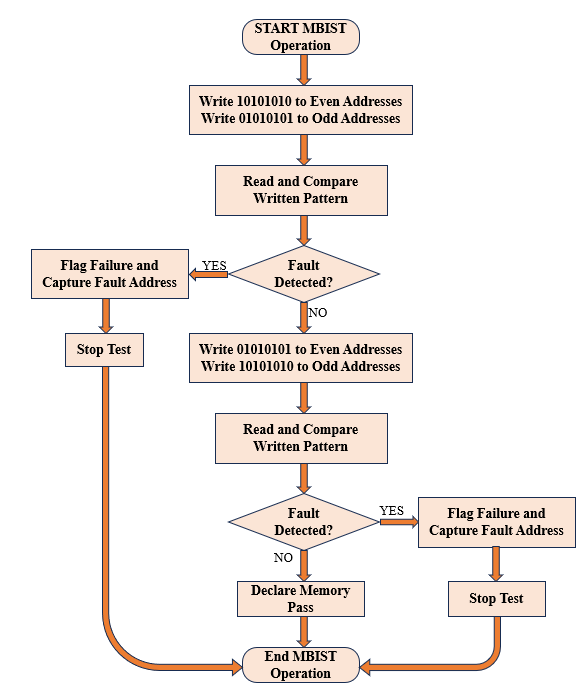

# NIELIT_Internship_MBIST
This repository contains Verilog RTL modules and testbenches developed during an MBIST project carried out as part of an internship at NIELIT. The work focuses on the design and simulation of a modular MBIST subsystem.

Internship Report : [MBIST Design](https://drive.google.com/file/d/1YK_dMg7-w7zG5oUzXT-INHLf0jP3pBU5/view?usp=drivesdk)

---
# Memory Built In Self Test  

This project presents the design and simulation of a parameterized and modular Memory 
Built-In Self-Test (MBIST) subsystem implemented using Verilog HDL. The proposed 
architecture is composed of independent functional modules, including a sequential address 
generator, a combinational checkerboard pattern generator, a comparator, and an FSM-based 
MBIST controller that coordinates the overall test operation.   

Unlike conventional MBIST implementations based on standard March algorithms, the 
proposed design employs a checkerboard test algorithm for memory testing. The algorithm 
alternately writes complementary data patterns 10101010 to even addresses and 01010101 to odd 
addresses, followed by the inverse pattern sequence to effectively detect data dependent and memory faults.   

The design is parameterized with respect to address and data widths, allowing easy scalability 
and reuse for different memory sizes. The proposed MBIST subsystem incorporates early fault 
detection, wherein the test process is immediately halted upon encountering a mismatch during 
read operations. In such cases, a fault flag is asserted and the corresponding fault address is 
reported. A memory wrapper is incorporated to support selection between normal CPU 
operation and MBIST mode using a test mode control signal, enabling seamless integration of 
the MBIST subsystem into larger digital systems. The complete MBIST subsystem is verified 
through simulation, with individual testbenches developed for each module as well as for the 
top-level subsystem. Simulation results confirm correct control sequencing, pattern generation, 
and fault detection behavior, demonstrating the functional correctness and flexibility of the 
proposed parameterized MBIST design.

---
## Flowchart

- The MBIST process is initiated upon assertion of the start signal, enabling the controller to 
take control of memory access through the test interface. 
- In the first test phase, a checkerboard pattern is generated such that logic 10101010 is 
written to even memory addresses and 01010101 is written to odd memory addresses, 
ensuring adjacent cells store complementary values. 
- Once the write operation completes, the memory contents are read sequentially and 
compared with the expected data pattern to verify correctness. 
- If a mismatch is detected during comparison, the controller immediately flags a failure 
condition, captures the corresponding fault address, and halts further test execution. 
- When no fault is detected in the first phase, the data pattern is inverted and written again to 
even and odd memory locations to increase fault detection capability. 
- A second read and compare cycle is performed to validate the inverted checkerboard pattern 
across the entire memory array. 
- Successful completion of both test phases without any detected fault results in the memory 
being declared functional, and the MBIST operation is terminated with a pass status. 
- The early termination feature of the flow ensures reduced test time by avoiding unnecessary 
memory accesses once a fault is identified.

---
## Limitations:  
- The current MBIST implementation supports only a checkerboard testing algorithm and 
does not include standard March-based tests. 
- Fault coverage is limited to the modeled memory behavior and does not include advanced 
fault models such as dynamic or timing-related faults. 
- The memory under test is a behavioral model and may not fully represent all real-world 
memory characteristics.

---

## Future Scope:  
- The design can be extended to support multiple MBIST algorithms such as March C, March 
SS, or hybrid test sequences. 
- Support for testing multiple memory instances and memory types can be added to improve 
scalability. 
- Additional fault logging and diagnostic features can be incorporated to enhance failure 
analysis.
